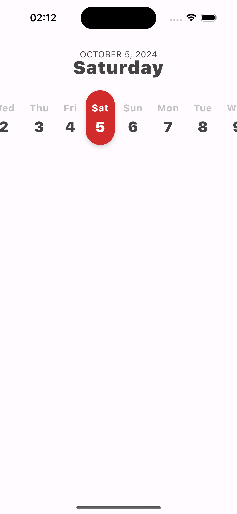

[](https://search.maven.org/artifact/io.github.chouaibmo/rowkalendar)

<p> 
  
</p>

## 💡 Description

RowKalendar is a Compose Multiplatform library designed to offer a straightforward and user-friendly
scrollable horizontal calendar component for both Android and iOS platforms.

## 📱 Supported platforms
this project supports the following platforms:

| Platform      | Android |   iOS   | Desktop | Browser |
|---------------|:-------:|:-------:|:-------:|:-------:|
| Supported     |   ✅    |   ✅    |    🚫   |   🚫    |

⏳ Support for Browser and Desktop (Linux, macOS, Windows) is planned for future releases.
Please note that the library is under active development, and some features may not be available across all platforms.

## 📸 Screenshots
<p>
  
  
  
</p>

## Videos
<p>
  
  
  

## ⚙️ Setup
To integrate RowKalendar into your project, add the following dependencies to the commonMain source set of your shared module:

```kotlin
commonMain.dependencies {
    implementation("io.github.chouaibmo:rowkalendar:<latest_version>")
    implementation("org.jetbrains.kotlinx:kotlinx-datetime:<latest_version>")
}
```
**Note**: RowKalendar utilizes the `kotlinx-datetime` library, which must also be included in your shared module dependencies.


## 📱 Usage
### Basic usage
RowKalendar provides a basic implementation of a date cell that can be used to display a simple row calendar.   
The following code snippet shows how to use the `RowKalendar` composable to display a simple row calendar
by making use of the `DateCell` composable provided by the library to display each day in the calendar.
```kotlin
import io.github.chouaibmo.rowkalendar.RowKalendar
import io.github.chouaibmo.rowkalendar.components.DateCell

@Composable
fun RowKalendarSample() {
    RowKalendar(
        modifier = Modifier.height(100.dp),
        content = { date, isSelected, onClick ->
            DateCell(
                date = date,
                isSelected = isSelected,
                onClick = onClick,
                modifier = Modifier.padding(6.dp)
            )

        }
    )
}
```   

DateCell is designed to be flexible and customizable, allowing you to customize its appearance by overriding the default values of certain properties.
The properties that can be customized include the `shape`, `elevation`, `border`, and `colors`:
- `border` property allows you to customize the border color and width of the `DateCell` composable based on its state (selected date, past date, or future date).
- `colors` property allows you to customize the text color and background color of the `DateCell` composable based on its state (selected date, past date, or future date).
- `shape` property allows you to customize the shape of the `DateCell` composable.
- `elevation` property allows you to customize the elevation of the `DateCell` composable.

The following code snippet demonstrates how to customize the appearance of the `DateCell` composable:
```kotlin
import androidx.compose.ui.graphics.Color
import androidx.compose.ui.unit.dp
import io.github.chouaibmo.rowkalendar.RowKalendar
import io.github.chouaibmo.rowkalendar.components.DateCell

@Composable
fun RowKalendarSample() {
    RowKalendar(
        modifier = Modifier.fillMaxWidth(),
        content = { date, isSelected, onClick ->
            DateCell(
                date = date,
                isSelected = isSelected,
                onClick = onClick,
                shape = RoundedCornerShape(12.dp),
                elevation = DateCellDefaults.DateCellElevation(
                    selectedElevation = 4.dp,
                    pastElevation = 2.dp,
                    futureElevation = 2.dp
                ),
                border = DateCellDefaults.border(
                    selectedBorderColor = Color.LightGray,
                    pastBorderColor = Color.LightGray,
                    futureBorderColor = Color.LightGray,
                    selectedBorderWidth = 1.dp,
                    pastBorderWidth = 1.dp,
                    futureBorderWidth = 1.dp
                ),
                colors = DateCellDefaults.colors(
                    selectedContainerColor = MaterialTheme.colorScheme.primary,
                    selectedTextColor = MaterialTheme.colorScheme.onPrimary,
                    pastContainerColor = MaterialTheme.colorScheme.secondary,
                    pastTextColor = MaterialTheme.colorScheme.onSecondary,
                    futureContainerColor = MaterialTheme.colorScheme.secondary,
                    futureTextColor = MaterialTheme.colorScheme.onSecondary
                ),
            )
        }
    )
}
```

### Use your own custom composable
If you prefer a more tailored approach that better aligns with your app's design and user experience,
you can provide your own composable as shown in the following code snippet:
```kotlin
import io.github.chouaibmo.rowkalendar.RowKalendar

@Composable
fun RowKalendarSample() {
    RowKalendar(
        modifier = Modifier.fillMaxWidth(),
        content = { date, isSelected, onClick ->
            // Your own custom composable
        }
    )
}
```

## 🤝 Contribution

If you wish to contribute, please feel free to submit pull requests or issues to help improve RowKalendar.

## 💙 Find this repository useful?
If you find this library useful, please consider starring the repository and sharing it with others :star:

# License
```xml
Licensed under the Apache License, Version 2.0 (the "License");
    you may not use this file except in compliance with the License.
    You may obtain a copy of the License at

    http://www.apache.org/licenses/LICENSE-2.0

    Unless required by applicable law or agreed to in writing, software
    distributed under the License is distributed on an "AS IS" BASIS,
    WITHOUT WARRANTIES OR CONDITIONS OF ANY KIND, either express or implied.
    See the License for the specific language governing permissions and
    limitations under the License.
```

